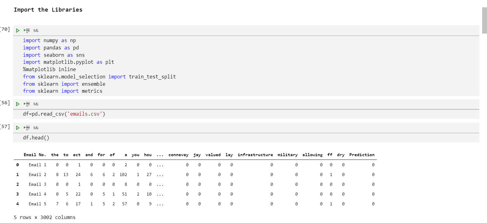
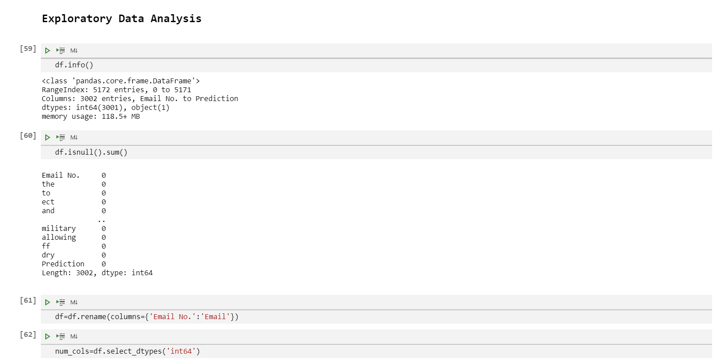
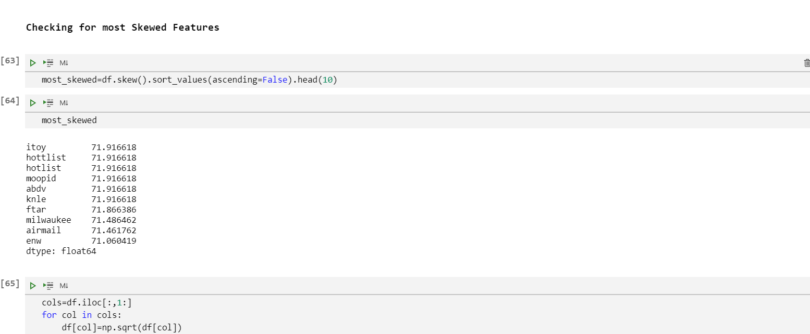
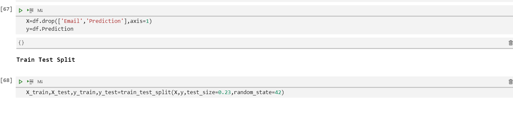
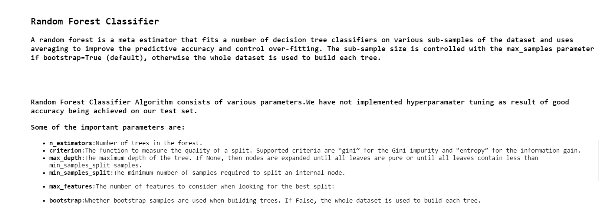
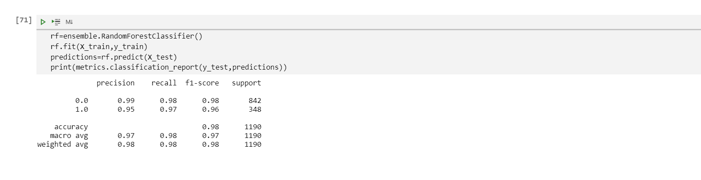
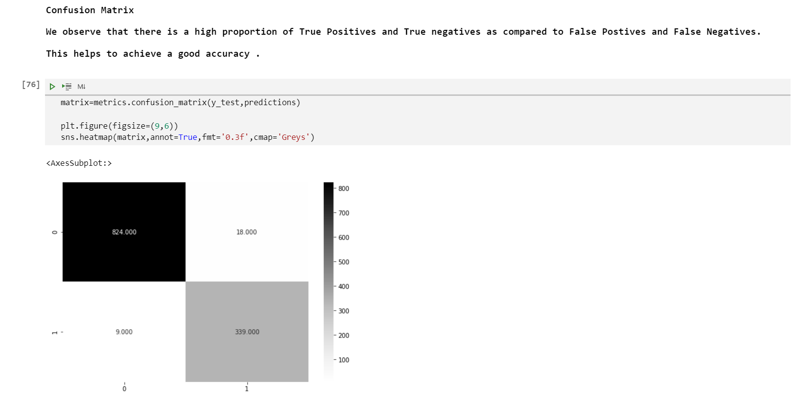
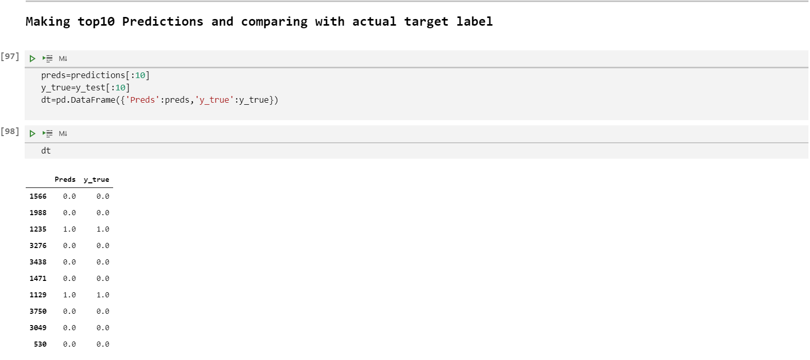

## **RANDOM FOREST CLASSIFIER**
</img>
#### INTRODUCTION
* Random forests or random decision forests are an ensemble learning method for classification, regression and other tasks that 
 operates by constructing a multitude of decision trees at training time. 

#### PURPOSE
* To understand the working of Random Forest Classifier on classification tasks.
* To get equipped with the libraries and practical implementation of the model on various datasets.

#### BREIF EXPLANATION
* Random Forest Classifier is a Supervised Machine Learning Algorithm.
* The forest it builds is an ensemble of Decision Trees usually trained with the bagging method.
* It builds multiple Decision Trees and merges them together to get more accurate and a stable prediction.

#### WORKING CONDITIONS

1. Data Exploration and Analysis.
* Import the libraries and read the data using pandas.

</img>
</img>
2. Checking For Skewness
* Check for skewness in data. High skewness apparently can hamper model performance.
* Modify the values in skewed features by replacing the values with their square root.

</img>
3. Splitting the Data into train and test set using sklearns train_test_split.

</img>
4. Building and Training the model.
* Build the model on default parameters.
* Fit the model and predict on test data set.
* Print classfication report providing information about accuracy,f1-score etc.

</img>
</img>
5.Inference and making predictions.
* Plot a confusion matrix to analyze how effectively model makes predictions.
* Confusion matrix provides with true positives,false porsitives, true negatives and false negative values.
* Higher number of True positive and True negative values implies good model performance.

</img>
</img>

#### DATASET
Link to the <a href=https://www.kaggle.com/balaka18/email-spam-classification-dataset-csv>Dataset</a>

#### USAGE
* Classification Tasks.
* Feature Selection, Recommendation engines etc.
* Usage in E-Commerce.
* Used in healtcare,banking and stock market.

#### USE CASES
* Tasks where data is non-linear.
* Classification Tasks where we need to predict dicrete values.
* Projects having large amounts of data.

#### LIBRARIES USED
* Pandas
* Numpy
* Matplotlib
* Scikit Learn
* Seaborn

#### ADVANTAGES
* Overfitting probelm is reduced.
* Can automatically handle missing values.
* No feature scaling required.
* Robust to outliers.

#### DISADVANTAGES
* Complexity
* Longer Training Period.

#### APPLICATIONS
* Classification Tasks.
* Business use cases like credit card fraud detection etc.

#### CONCLUSION
* Random Forest Classifier can be used for solving Supervised learning tasks.
* They can be trained on large amount of data and are robust to outliers.
* Labelled Data needs to be provided in order to make predictions.
* Insights can be derived for Business use cases.

#### REFERENCES
* <a href=https://www.kaggle.com/balaka18/email-spam-classification-dataset-csv>Link</a> to the Dataset.
* https://scikit-learn.org/stable/modules/generated/sklearn.ensemble.RandomForestClassifier.html

### Author

Hey, This is Hrugved Kolhe.

<a href="https://github.com/hrugved06"> <b> Hrugved Kolhe</b></a>
 

  

 

 